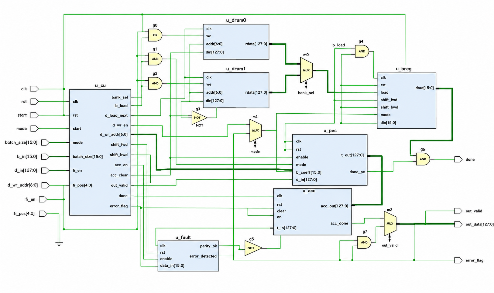
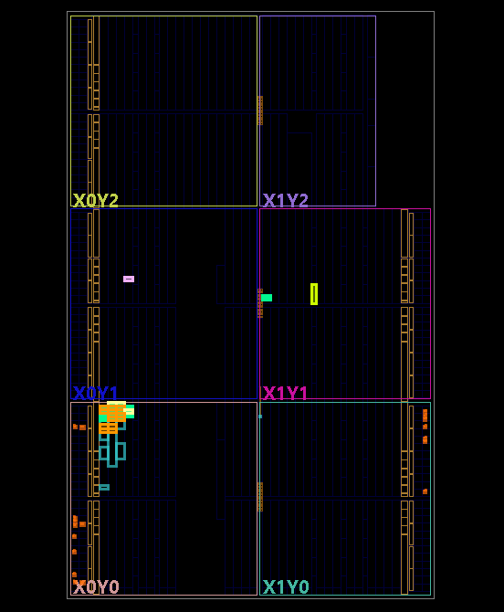

# SCALES-X: A Stall-Free Streaming Accelerator for Unified BFV and NTRU Polynomial Multiplication

**Authors:** Kamalnath A. and Madhav Rao

**Affiliation:** Department of Electronics and Communication Engineering, International Institute of Information Technology, Bangalore (IIIT-B)

---

## 📌 Project Overview

**SCALES-X** is a unified, dual-mode systolic streaming hardware accelerator designed for high-degree ternary polynomial multiplication over finite rings, serving both the **Brakerski-Fan-Vercauteren (BFV)** and **NTRU** cryptographic systems.

Unlike conventional, rigid architectures optimized for a single protocol, SCALES-X implements a shared systolic datapath that supports both negacyclic (BFV) and cyclic (NTRU) ring reduction without duplicating hardware resources.

---

## 🚀 Key Features

* **Unified Dual-Mode Architecture:** A shared arithmetic pipeline that executes both BFV ($x^{N_{\text{ACT}}} + 1$) and NTRU ($x^{N_{\text{ACT}}} - 1$) ring operations via a polymorphic shift mechanism.
* **Stall-Free Ping-Pong Memory Engine:** Integrates an interleaved dual-bank memory controller that overlaps processing array computation with background I/O operations, completely eliminating pipeline stalls during continuous workloads.
* **Optimized Ternary Encoding:** Uses a 2-bit ternary mapping ($\{-1, 0, 1\}$) inside the Processing Elements (PEs). This replaces complex, area-heavy multi-bit multipliers with lightweight sign-inverting multiplexers and 2's complement adders.
* **Non-Power-of-Two Support:** Built-in structural support for arbitrary, non-power-of-two polynomial dimensions ($N_{\text{ACT}}$).
* **Integrated Fault Monitoring:** Incorporates a Concurrent Error Detection (CED) parity-check module that dynamically flags anomalies and halts the controller to defend against Single Event Upsets (SEUs) and fault-injection attacks.

---

## 📐 Hardware Architecture Schematic

The structural interconnection of the co-processor macro—highlighting the global control paths, interleaved memory engine (`u_dram0`/`u_dram1`), polymorphic ternary shift register array (`u_breg`), the systolic core (`u_pec`), and concurrent error tracking logic (`u_fault`)—is mapped below:



---

## 📊 Implementation Results & Performance

SCALES-X was synthesized and implemented targeting the **AMD-Xilinx Artix-7 (xc7a35tcpg236-1)** FPGA using Xilinx Vivado. Compared to the baseline SCALES architecture, it delivers exceptional area savings and performance improvements:

### Resource and Timing Comparison

| Resource Primitive | Baseline SCALES | Proposed **SCALES-X** | Absolute Reduction | Percentage Reduction |
| --- | --- | --- | --- | --- |
| **Look-Up Tables (LUT)** | 350 | **180** | 170 | **48.86%** |
| **Slice Registers (FF)** | 485 | **168** | 317 | **65.36%** |
| **Distributed LUTRAM** | 76 | **0** | 76 | **100.0%** |
| **Worst Negative Slack (WNS)** | 2.081 ns | **1.740 ns** | — | — |
| **Max Frequency ($F_{\text{max}}$)** | 144.53 MHz | **137.74 MHz** | — | — |

### Power Consumption

* **Total On-Chip Power:** Reduced to **0.078 W** (0.060 W Dynamic, 0.018 W Static).

### Throughput Scaling (Ping-Pong Batching)

Throughput scales up to **1.28x** for continuous workloads by hiding transfer overheads:

| Workload Batch Size | Total Clock Cycles | Throughput Factor |
| --- | --- | --- |
| 1 (Non-Batched) | 164 | 1.00x |
| 2 (Dual Stream) | 282 | 1.16x |
| 4 (Quad Interleaved) | 520 | 1.26x |
| 5 (Continuous Array) | 640 | **1.28x** |

### 🗺️ FPGA Physical Device Floorplan
The post-route physical placement and cell distribution map of the accelerator logic across the Artix-7 fabric coordinate zones is illustrated here:



---

## 🛠️ Simulation & Parameters

The core variables verified in the validation environment are:

* **Maximum Structural Capacity ($N$):** 8
* **Active Polynomial Dimension ($N_{\text{ACT}}$):** 5
* **Accumulator Depth per PEC ($V$):** 2
* **PEC Vector Width ($U$):** 4
* **Coefficient Bit-Width ($K$):** 32 bits

Verification is done by running cycle-by-cycle RTL behavioral simulations. The hardware output matches software golden models exactly.

---

## 📜 Citation

If you use SCALES-X in your research, please cite our paper:

```bibtex
@inproceedings{scales_x_2026,
  author    = {Kamalnath A. and Madhav Rao},
  title     = {SCALES-X: A Stall-Free Streaming Accelerator for Unified BFV and NTRU Polynomial Multiplication},
  booktitle = {International Institute of Information Technology, Bangalore},
  year      = {2026}
}
